# ESSEN Credentialing Platform — Data Model

**Version**: 0.1 (Pre-Implementation)
**Last Updated**: 2026-04-14
**Status**: Draft — Pending stakeholder review

---

## Overview

This document defines the core data entities, their fields, relationships, and business rules. The Entity Relationship Diagram (ERD) at the end of this document shows the relationships visually.

All entities include implicit fields unless noted:
- `id` — UUID primary key
- `created_at` — UTC timestamp
- `updated_at` — UTC timestamp
- `created_by` — FK to User
- `updated_by` — FK to User

PHI fields (SSN, DOB, home address) are **encrypted at rest** using AES-256. Decryption occurs only at the application layer.

---

## Entity: User

Represents all system users — both staff (internal) and providers (external).

| Field | Type | Description |
|-------|------|-------------|
| `id` | UUID | Primary key |
| `email` | String (unique) | Login email. For staff, must match Azure AD account |
| `display_name` | String | Full name |
| `role` | Enum | `provider`, `specialist`, `manager`, `committee_member`, `admin` |
| `azure_ad_oid` | String (nullable) | Azure AD Object ID — for staff SSO users |
| `provider_id` | FK → Provider (nullable) | Linked provider record (for Provider role only) |
| `is_active` | Boolean | Whether the user can log in |
| `last_login_at` | Timestamp | Last successful login |
| `notification_preferences` | JSON | Per-channel notification settings |

**Business rules**:
- Staff users (all roles except `provider`) must have a non-null `azure_ad_oid` matching their Essen Azure AD account.
- A Provider role user must have a linked `provider_id`.
- Deactivated users (`is_active = false`) cannot authenticate.
- Each email address must be unique across all users.

---

## Entity: Provider

The central entity representing a healthcare professional being credentialed.

| Field | Type | Description |
|-------|------|-------------|
| `id` | UUID | Primary key |
| `status` | Enum | `invited` / `onboarding_in_progress` / `documents_pending` / `verification_in_progress` / `committee_ready` / `committee_in_review` / `approved` / `denied` / `deferred` / `inactive` |
| `provider_type_id` | FK → ProviderType | MD, DO, PA, NP, LCSW, LMHC, etc. |
| `assigned_specialist_id` | FK → User (nullable) | Assigned credentialing specialist |
| `legal_first_name` | String | Legal first name |
| `legal_middle_name` | String (nullable) | Legal middle name |
| `legal_last_name` | String | Legal last name |
| `preferred_name` | String (nullable) | Preferred/display name |
| `date_of_birth` | Date (encrypted) | Date of birth |
| `ssn` | String (encrypted) | Social Security Number — full, encrypted at rest |
| `gender` | String (nullable) | Gender identity |
| `languages_spoken` | String[] | Languages spoken |
| `npi` | String (nullable) | National Provider Identifier (10 digits) |
| `dea_number` | String (nullable) | DEA registration number |
| `caqh_id` | String (nullable) | CAQH provider ID |
| `icims_id` | String (nullable) | iCIMS HRIS system ID |
| `medicare_ptan` | String (nullable) | Medicare Provider Transaction Access Number |
| `medicaid_id` | String (nullable) | Medicaid provider ID |
| `invite_sent_at` | Timestamp (nullable) | When outreach email was sent |
| `invite_token` | String (nullable) | Unique token in outreach link (hashed) |
| `invite_token_expires_at` | Timestamp (nullable) | Token expiry (72 hours from send) |
| `application_started_at` | Timestamp (nullable) | When provider clicked BEGIN APPLICATION |
| `application_submitted_at` | Timestamp (nullable) | When provider completed attestation |
| `committee_ready_at` | Timestamp (nullable) | When moved to committee queue |
| `approved_at` | Timestamp (nullable) | Committee approval timestamp |
| `approval_session_id` | FK → CommitteeSession (nullable) | Committee session in which provider was approved |
| `approved_by` | FK → User (nullable) | Manager who stamped the approval |
| `denial_reason` | String (nullable) | If denied/deferred, reason |
| `notes` | Text (nullable) | Internal notes (staff only) |

**Business rules**:
- SSN is stored encrypted; only decrypted in application layer when needed for DEA/ABFM verification bots.
- Status transitions are tracked in `AuditLog`. Invalid transitions (e.g., `approved` → `documents_pending`) are blocked.
- A provider cannot have `approved` status without a non-null `approved_at` and `approval_session_id`.

---

## Entity: ProviderType

Configures the types of providers that can be credentialed. Extensible by admin.

| Field | Type | Description |
|-------|------|-------------|
| `id` | UUID | Primary key |
| `name` | String (unique) | Full name (e.g., "Physician Assistant") |
| `abbreviation` | String (unique) | Short code (e.g., "PA") |
| `is_active` | Boolean | Whether this type can be assigned to new providers |
| `requires_ecfmg` | Boolean | If true, ECFMG cert required for international medical graduates |
| `requires_dea` | Boolean | If true, DEA cert is required |
| `requires_boards` | Boolean | If true, board certification is required |
| `board_type` | String (nullable) | Default board type for this provider type (e.g., "NCCPA" for PA) |

---

## Entity: DocumentRequirement

Defines which documents are required, conditional, or not applicable for each provider type.

| Field | Type | Description |
|-------|------|-------------|
| `id` | UUID | Primary key |
| `provider_type_id` | FK → ProviderType | Which provider type this rule applies to |
| `document_type` | Enum | See document type enum below |
| `requirement` | Enum | `required` / `conditional` / `not_applicable` |
| `condition_description` | String (nullable) | Human-readable condition (e.g., "Required for international medical graduates") |

**Document Type Enum values**:
`photo_id`, `ssn_card`, `cv_resume`, `professional_liability_insurance`, `original_license`, `license_registration`, `dea_certificate`, `medical_school_diploma`, `graduate_certificate`, `ecfmg_certificate`, `board_certification`, `cme_credits`, `bls_card`, `acls_card`, `pals_card`, `infection_control_certificate`, `child_abuse_certificate`, `pain_management_certificate`, `physical_exam_mmr`, `physical_exam_ppd`, `chest_xray`, `flu_shot`, `hospital_appointment_letter`, `hospital_reappointment_letter`, `internship_certificate`, `residency_certificate`, `fellowship_certificate`

---

## Entity: ProviderProfile

Detailed demographic and professional information for a provider. Separated from `Provider` to keep the core provider record lightweight.

| Field | Type | Description |
|-------|------|-------------|
| `id` | UUID | Primary key |
| `provider_id` | FK → Provider (unique) | One-to-one with Provider |
| `home_address_line1` | String (encrypted) | Street address line 1 |
| `home_address_line2` | String (encrypted, nullable) | Apartment/suite |
| `home_city` | String (encrypted) | City |
| `home_state` | String (encrypted) | State |
| `home_zip` | String (encrypted) | ZIP code |
| `home_phone` | String (encrypted) | Home phone |
| `mobile_phone` | String | Mobile/cell phone (used for SMS reminders) |
| `personal_email` | String | Personal email (used for outreach) |
| `emergency_contact_name` | String (nullable) | |
| `emergency_contact_phone` | String (nullable) | |
| `ecfmg_number` | String (nullable) | ECFMG certificate number (international MDs) |
| `medical_school_name` | String (nullable) | |
| `medical_school_country` | String (nullable) | |
| `graduation_year` | Integer (nullable) | Year of medical school graduation |
| `specialty_primary` | String (nullable) | Primary medical specialty |
| `specialty_secondary` | String (nullable) | Secondary specialty |
| `hire_date` | Date (nullable) | Date hired at Essen (from iCIMS) |
| `start_date` | Date (nullable) | Clinical start date at Essen |
| `facility_assignment` | String (nullable) | Primary facility/location |
| `department` | String (nullable) | Department within Essen |
| `job_title` | String (nullable) | Job title (from iCIMS) |
| `caqh_data_snapshot` | JSON (nullable) | Last CAQH ingestion payload (for reference) |
| `icims_data_snapshot` | JSON (nullable) | Last iCIMS ingestion payload (for reference) |

---

## Entity: License

Represents a state medical license held by a provider. A provider may hold multiple licenses.

| Field | Type | Description |
|-------|------|-------------|
| `id` | UUID | Primary key |
| `provider_id` | FK → Provider | |
| `state` | String | US state abbreviation (e.g., "NY", "NJ") |
| `license_number` | String | License number |
| `license_type` | String | Type of license (e.g., "MD", "PA-C", "LCSW") |
| `status` | Enum | `active` / `inactive` / `expired` / `suspended` / `revoked` |
| `issue_date` | Date (nullable) | |
| `expiration_date` | Date (nullable) | |
| `is_primary` | Boolean | Whether this is the provider's primary license |
| `source` | Enum | `caqh` / `manual` / `ocr` | How the license was entered |

---

## Entity: Document

Represents a file uploaded to the platform (by provider or ingested from HR).

| Field | Type | Description |
|-------|------|-------------|
| `id` | UUID | Primary key |
| `provider_id` | FK → Provider | |
| `document_type` | Enum | Same enum as DocumentRequirement.document_type |
| `original_filename` | String | File name as uploaded |
| `blob_url` | String | Azure Blob Storage URL |
| `blob_container` | String | Azure Blob container name |
| `blob_path` | String | Path within container |
| `file_size_bytes` | Integer | |
| `mime_type` | String | e.g., `application/pdf`, `image/jpeg` |
| `uploaded_by` | FK → User | Who uploaded (provider or staff) |
| `source` | Enum | `provider_upload` / `hr_ingestion` / `email_ingestion` / `bot_output` |
| `ocr_status` | Enum | `pending` / `processing` / `completed` / `failed` / `skipped` |
| `ocr_data` | JSON (nullable) | Extracted field values from OCR |
| `ocr_confidence` | Float (nullable) | Confidence score (0–1) |
| `is_verified` | Boolean | Whether this document has been PSV-verified |
| `verification_record_id` | FK → VerificationRecord (nullable) | Linked PSV verification |
| `expiration_date` | Date (nullable) | Expiration date extracted from document |
| `is_deleted` | Boolean | Soft delete flag |

---

## Entity: ChecklistItem

Tracks the real-time status of each document requirement for a specific provider.

| Field | Type | Description |
|-------|------|-------------|
| `id` | UUID | Primary key |
| `provider_id` | FK → Provider | |
| `document_type` | Enum | Same enum as DocumentRequirement |
| `status` | Enum | `received` / `pending` / `needs_attention` |
| `document_id` | FK → Document (nullable) | Most recently uploaded document for this item |
| `manually_flagged` | Boolean | Whether a staff member manually set this to needs_attention |
| `flag_reason` | String (nullable) | Why it was flagged |
| `flagged_by` | FK → User (nullable) | |
| `received_at` | Timestamp (nullable) | When status last changed to `received` |

---

## Entity: VerificationRecord

Records the outcome of a Primary Source Verification (PSV) bot run.

| Field | Type | Description |
|-------|------|-------------|
| `id` | UUID | Primary key |
| `provider_id` | FK → Provider | |
| `bot_run_id` | FK → BotRun | The bot run that produced this result |
| `credential_type` | Enum | `license` / `dea` / `board_nccpa` / `board_abim` / `board_abfm` / `board_other` / `oig_sanctions` / `sam_sanctions` / `npdb` / `emedral` / `hospital_privilege` / `expirable_renewal` |
| `status` | Enum | `verified` / `flagged` / `not_found` / `expired` / `error` |
| `verified_date` | Date | Date the verification was performed |
| `expiration_date` | Date (nullable) | Expiration date of the verified credential |
| `source_website` | String | URL of the verification source |
| `result_details` | JSON | Structured result data (e.g., license number, status, board ID) |
| `pdf_blob_url` | String (nullable) | Azure Blob URL of the verification PDF/screenshot |
| `output_filename` | String (nullable) | File name (per naming convention) |
| `is_flagged` | Boolean | Whether result requires staff attention |
| `flag_reason` | String (nullable) | Why result is flagged |
| `acknowledged_by` | FK → User (nullable) | Staff who acknowledged a flag |
| `acknowledged_at` | Timestamp (nullable) | |

---

## Entity: BotRun

Tracks a single execution of a PSV bot.

| Field | Type | Description |
|-------|------|-------------|
| `id` | UUID | Primary key |
| `provider_id` | FK → Provider | |
| `bot_type` | Enum | `license_verification` / `dea_verification` / `board_nccpa` / `board_abim` / `board_abfm` / `oig_sanctions` / `sam_sanctions` / `npdb` / `emedral_etin` / `expirable_renewal` / `enrollment_submission` |
| `triggered_by` | Enum | `automatic` / `manual` |
| `triggered_by_user_id` | FK → User (nullable) | If manual, who triggered it |
| `status` | Enum | `queued` / `running` / `completed` / `failed` / `retrying` |
| `attempt_count` | Integer | Number of attempts (max 3) |
| `queued_at` | Timestamp | |
| `started_at` | Timestamp (nullable) | |
| `completed_at` | Timestamp (nullable) | |
| `input_data` | JSON | Inputs provided to the bot (e.g., license number, state) |
| `output_data` | JSON (nullable) | Structured output from bot |
| `error_message` | String (nullable) | Error details if failed |
| `log_blob_url` | String (nullable) | Azure Blob URL of full execution log |

---

## Entity: Task

An actionable item assigned to a staff member related to a provider.

| Field | Type | Description |
|-------|------|-------------|
| `id` | UUID | Primary key |
| `provider_id` | FK → Provider | |
| `title` | String | Short task description |
| `description` | Text (nullable) | Detailed notes |
| `assigned_to` | FK → User | Assigned staff member |
| `priority` | Enum | `high` / `medium` / `low` |
| `status` | Enum | `open` / `in_progress` / `completed` / `blocked` |
| `due_date` | Date (nullable) | |
| `completed_at` | Timestamp (nullable) | |
| `completed_by` | FK → User (nullable) | |

---

## Entity: TaskComment

Comments on a task, supporting threaded discussion.

| Field | Type | Description |
|-------|------|-------------|
| `id` | UUID | Primary key |
| `task_id` | FK → Task | |
| `author_id` | FK → User | |
| `body` | Text | Comment content |
| `mentioned_user_ids` | UUID[] | Users @mentioned in this comment |

---

## Entity: Communication

Log of all communications sent or received related to a provider.

| Field | Type | Description |
|-------|------|-------------|
| `id` | UUID | Primary key |
| `provider_id` | FK → Provider | |
| `communication_type` | Enum | `outreach_email` / `follow_up_email` / `sms` / `phone_log` / `internal_note` / `committee_agenda_email` |
| `direction` | Enum | `outbound` / `inbound` (inbound = provider replied) |
| `channel` | Enum | `email` / `sms` / `phone` / `internal` |
| `from_user_id` | FK → User (nullable) | Staff sender (null for automated) |
| `to_address` | String (nullable) | Email address or phone number |
| `subject` | String (nullable) | Email subject |
| `body` | Text | Message content or phone call notes |
| `template_id` | String (nullable) | Template used, if any |
| `delivery_status` | Enum | `sent` / `delivered` / `failed` / `bounced` / `logged` (for phone) |
| `sent_at` | Timestamp | |
| `delivery_confirmed_at` | Timestamp (nullable) | |

---

## Entity: CommitteeSession

A scheduled credentialing committee review meeting.

| Field | Type | Description |
|-------|------|-------------|
| `id` | UUID | Primary key |
| `session_date` | Date | Scheduled date of the committee meeting |
| `session_time` | Time (nullable) | Scheduled time |
| `location` | String (nullable) | Physical location or video link |
| `status` | Enum | `scheduled` / `in_progress` / `completed` / `cancelled` |
| `agenda_blob_url` | String (nullable) | Azure Blob URL of the generated agenda PDF |
| `agenda_sent_at` | Timestamp (nullable) | When the agenda was emailed |
| `agenda_version` | Integer | Increments each time agenda is regenerated |
| `committee_member_ids` | UUID[] | Users (Committee Member or Manager role) assigned |
| `notes` | Text (nullable) | Session notes |

---

## Entity: CommitteeProvider

A join entity representing a specific provider's inclusion in a committee session.

| Field | Type | Description |
|-------|------|-------------|
| `id` | UUID | Primary key |
| `committee_session_id` | FK → CommitteeSession | |
| `provider_id` | FK → Provider | |
| `agenda_order` | Integer | Position on the agenda |
| `summary_blob_url` | String (nullable) | Per-provider summary sheet PDF |
| `summary_version` | Integer | Version counter |
| `decision` | Enum (nullable) | `approved` / `denied` / `deferred` / `conditional` |
| `decision_date` | Date (nullable) | |
| `decision_by` | FK → User (nullable) | Manager who recorded the decision |
| `denial_reason` | String (nullable) | If denied/deferred |
| `conditional_items` | Text (nullable) | If conditional approval, outstanding items |
| `committee_notes` | Text (nullable) | Notes from committee members |

---

## Entity: Enrollment

Tracks a provider's enrollment submission to a payer.

| Field | Type | Description |
|-------|------|-------------|
| `id` | UUID | Primary key |
| `provider_id` | FK → Provider | |
| `payer_name` | String | Name of payer (e.g., "UHC", "Anthem", "MetroPlus") |
| `enrollment_type` | Enum | `delegated` / `facility_btc` / `direct` |
| `submission_method` | Enum | `portal_mpp` / `portal_availity` / `portal_verity` / `portal_eyemed` / `portal_vns` / `email` / `ftp` |
| `portal_name` | String (nullable) | Portal name if submission_method is portal |
| `status` | Enum | `draft` / `submitted` / `pending_payer` / `enrolled` / `denied` / `error` / `withdrawn` |
| `submitted_at` | Timestamp (nullable) | |
| `submitted_by` | FK → User (nullable) | |
| `submission_file_blob_url` | String (nullable) | Roster or application file |
| `payer_confirmation_number` | String (nullable) | Reference number from payer |
| `effective_date` | Date (nullable) | Date enrollment became effective |
| `payer_response_date` | Timestamp (nullable) | |
| `payer_response_notes` | Text (nullable) | |
| `denial_reason` | String (nullable) | |
| `follow_up_due_date` | Date (nullable) | Next required follow-up date |
| `follow_up_cadence_days` | Integer | Days between follow-ups (configured per payer) |
| `assigned_to` | FK → User (nullable) | |

---

## Entity: EnrollmentFollowUp

Log of follow-up actions taken on an enrollment record.

| Field | Type | Description |
|-------|------|-------------|
| `id` | UUID | Primary key |
| `enrollment_id` | FK → Enrollment | |
| `follow_up_date` | Date | Date follow-up was performed |
| `performed_by` | FK → User | |
| `outcome` | String | Notes on payer response |
| `next_follow_up_date` | Date (nullable) | Next follow-up date set |

---

## Entity: Expirable

Tracks a specific credential or certification with an expiration date for a provider.

| Field | Type | Description |
|-------|------|-------------|
| `id` | UUID | Primary key |
| `provider_id` | FK → Provider | |
| `expirable_type` | Enum | `acls` / `bls` / `pals` / `infection_control` / `pain_mgmt_hcs` / `pain_mgmt_part1` / `pain_mgmt_part2` / `flu_shot` / `physical_exam` / `ppd` / `quantiferon` / `chest_xray` / `identification` / `hospital_privilege` / `caqh_attestation` / `medicaid_etin` / `medicaid_revalidation_provider` / `medicaid_revalidation_group` / `medicare_revalidation_provider` / `medicare_revalidation_group` / `state_license` / `dea` / `board_certification` / `malpractice_insurance` |
| `status` | Enum | `current` / `expiring_soon` / `expired` / `pending_renewal` / `renewed` |
| `expiration_date` | Date | Current expiration date |
| `renewal_confirmed_date` | Date (nullable) | Date renewal was confirmed |
| `new_expiration_date` | Date (nullable) | Updated expiration after renewal |
| `document_id` | FK → Document (nullable) | Current credential document |
| `screenshot_blob_url` | String (nullable) | Renewal confirmation screenshot |
| `last_verified_date` | Date (nullable) | Date of last PSV check |
| `next_check_date` | Date | Date the system should next check for renewal |
| `outreach_sent_at` | Timestamp (nullable) | When provider outreach was last sent |
| `renewal_cadence_days` | Integer | Expected renewal frequency in days |

---

## Entity: SanctionsCheck

Records the result of an OIG or SAM.gov exclusion check.

| Field | Type | Description |
|-------|------|-------------|
| `id` | UUID | Primary key |
| `provider_id` | FK → Provider | |
| `source` | Enum | `oig` / `sam_gov` |
| `run_date` | Date | Date check was performed |
| `triggered_by` | Enum | `automatic_initial` / `automatic_monthly` / `manual` |
| `triggered_by_user_id` | FK → User (nullable) | |
| `result` | Enum | `clear` / `flagged` |
| `exclusion_type` | String (nullable) | Type of exclusion if flagged |
| `exclusion_effective_date` | Date (nullable) | |
| `exclusion_basis` | String (nullable) | Reason for exclusion |
| `pdf_blob_url` | String (nullable) | Screenshot/PDF of results |
| `is_acknowledged` | Boolean | Whether a Manager has acknowledged a flag |
| `acknowledged_by` | FK → User (nullable) | |
| `acknowledged_at` | Timestamp (nullable) | |
| `bot_run_id` | FK → BotRun (nullable) | |

---

## Entity: NPDBRecord

Records NPDB query results.

| Field | Type | Description |
|-------|------|-------------|
| `id` | UUID | Primary key |
| `provider_id` | FK → Provider | |
| `query_date` | Date | |
| `query_type` | Enum | `initial` / `continuous_alert` / `on_demand` |
| `continuous_query_enrolled` | Boolean | Whether continuous query is active |
| `continuous_query_enrollment_date` | Date (nullable) | |
| `result` | Enum | `no_reports` / `reports_found` |
| `report_count` | Integer | Number of reports found |
| `reports` | JSON | Structured report data (type, date, reporting entity, amount if malpractice) |
| `query_confirmation_number` | String (nullable) | NPDB-issued confirmation number |
| `report_blob_url` | String (nullable) | Full NPDB report PDF |
| `is_acknowledged` | Boolean | |
| `acknowledged_by` | FK → User (nullable) | |
| `acknowledged_at` | Timestamp (nullable) | |
| `bot_run_id` | FK → BotRun (nullable) | |

---

## Entity: HospitalPrivilege

Tracks privilege applications and status at individual facilities.

| Field | Type | Description |
|-------|------|-------------|
| `id` | UUID | Primary key |
| `provider_id` | FK → Provider | |
| `facility_name` | String | |
| `facility_address` | String (nullable) | |
| `privilege_type` | String | e.g., "Admitting", "Courtesy", "Consulting", "Telemedicine" |
| `status` | Enum | `applied` / `pending_review` / `approved` / `denied` / `expired` / `reappointment_due` |
| `applied_date` | Date (nullable) | |
| `approved_date` | Date (nullable) | |
| `effective_date` | Date (nullable) | |
| `expiration_date` | Date (nullable) | |
| `appointment_letter_doc_id` | FK → Document (nullable) | |
| `reappointment_letter_doc_id` | FK → Document (nullable) | |
| `submitted_by` | FK → User (nullable) | |
| `denial_reason` | String (nullable) | |
| `notes` | Text (nullable) | |

---

## Entity: MedicaidEnrollment

Tracks NY Medicaid / eMedNY enrollment and ETIN affiliation.

| Field | Type | Description |
|-------|------|-------------|
| `id` | UUID | Primary key |
| `provider_id` | FK → Provider | |
| `enrollment_subtype` | Enum | `individual` / `group` |
| `payer` | String | e.g., "eMedNY", "NJ Medicaid" |
| `etin_number` | String (nullable) | ETIN assigned |
| `affiliation_status` | Enum | `pending` / `in_process` / `enrolled` / `revalidation_due` / `expired` |
| `application_populated_at` | Timestamp (nullable) | |
| `provider_signature_required` | Boolean | |
| `provider_signature_received_at` | Timestamp (nullable) | |
| `submission_date` | Date (nullable) | Date submitted to eMedNY |
| `enrollment_effective_date` | Date (nullable) | |
| `revalidation_due_date` | Date (nullable) | |
| `last_follow_up_date` | Date (nullable) | |
| `notes` | Text (nullable) | |
| `bot_run_id` | FK → BotRun (nullable) | |

---

## Entity: AuditLog

Immutable record of every action taken in the system.

| Field | Type | Description |
|-------|------|-------------|
| `id` | UUID | Primary key |
| `timestamp` | Timestamp (UTC) | When the action occurred |
| `actor_id` | FK → User (nullable) | Who performed the action (null = system/automated) |
| `actor_role` | String | Role of actor at time of action |
| `action` | String | e.g., `provider.status.changed`, `document.uploaded`, `task.created`, `bot.run.completed` |
| `entity_type` | String | e.g., `Provider`, `Document`, `BotRun` |
| `entity_id` | UUID | ID of the affected entity |
| `provider_id` | FK → Provider (nullable) | Provider this action relates to (if applicable) |
| `before_state` | JSON (nullable) | State before change (for update actions) |
| `after_state` | JSON (nullable) | State after change |
| `metadata` | JSON (nullable) | Additional context (e.g., IP address, session ID) |

**Retention**: 10 years minimum. Immutable — no UPDATE or DELETE on this table.

---

## Entity Relationship Diagram

```mermaid
erDiagram
    User {
        uuid id PK
        string email
        string role
        string azure_ad_oid
        uuid provider_id FK
    }

    Provider {
        uuid id PK
        string status
        uuid provider_type_id FK
        uuid assigned_specialist_id FK
        string legal_first_name
        string legal_last_name
        string npi
        string dea_number
        string caqh_id
        string icims_id
        string ssn_encrypted
        date date_of_birth_encrypted
    }

    ProviderType {
        uuid id PK
        string name
        string abbreviation
        bool requires_dea
        bool requires_boards
    }

    ProviderProfile {
        uuid id PK
        uuid provider_id FK
        string specialty_primary
        string medical_school_name
        string facility_assignment
        json caqh_data_snapshot
        json icims_data_snapshot
    }

    DocumentRequirement {
        uuid id PK
        uuid provider_type_id FK
        string document_type
        string requirement
    }

    License {
        uuid id PK
        uuid provider_id FK
        string state
        string license_number
        string status
        date expiration_date
    }

    Document {
        uuid id PK
        uuid provider_id FK
        string document_type
        string blob_url
        string ocr_status
        json ocr_data
        bool is_verified
        uuid verification_record_id FK
    }

    ChecklistItem {
        uuid id PK
        uuid provider_id FK
        string document_type
        string status
        uuid document_id FK
    }

    BotRun {
        uuid id PK
        uuid provider_id FK
        string bot_type
        string status
        int attempt_count
        json input_data
        json output_data
    }

    VerificationRecord {
        uuid id PK
        uuid provider_id FK
        uuid bot_run_id FK
        string credential_type
        string status
        date verified_date
        date expiration_date
        string pdf_blob_url
        bool is_flagged
    }

    Task {
        uuid id PK
        uuid provider_id FK
        uuid assigned_to FK
        string title
        string priority
        string status
        date due_date
    }

    Communication {
        uuid id PK
        uuid provider_id FK
        uuid from_user_id FK
        string communication_type
        string channel
        string delivery_status
        timestamp sent_at
    }

    CommitteeSession {
        uuid id PK
        date session_date
        string status
        string agenda_blob_url
    }

    CommitteeProvider {
        uuid id PK
        uuid committee_session_id FK
        uuid provider_id FK
        int agenda_order
        string decision
        date decision_date
    }

    Enrollment {
        uuid id PK
        uuid provider_id FK
        string payer_name
        string enrollment_type
        string status
        date follow_up_due_date
    }

    Expirable {
        uuid id PK
        uuid provider_id FK
        string expirable_type
        string status
        date expiration_date
        date next_check_date
    }

    SanctionsCheck {
        uuid id PK
        uuid provider_id FK
        string source
        date run_date
        string result
        bool is_acknowledged
    }

    NPDBRecord {
        uuid id PK
        uuid provider_id FK
        date query_date
        string result
        bool continuous_query_enrolled
        bool is_acknowledged
    }

    HospitalPrivilege {
        uuid id PK
        uuid provider_id FK
        string facility_name
        string status
        date expiration_date
    }

    MedicaidEnrollment {
        uuid id PK
        uuid provider_id FK
        string etin_number
        string affiliation_status
        date revalidation_due_date
    }

    AuditLog {
        uuid id PK
        uuid actor_id FK
        timestamp timestamp
        string action
        string entity_type
        uuid entity_id
        uuid provider_id FK
        json before_state
        json after_state
    }

    Provider ||--|| ProviderProfile : "has"
    Provider }o--|| ProviderType : "is a"
    Provider }o--o| User : "assigned to"
    ProviderType ||--o{ DocumentRequirement : "has requirements"
    Provider ||--o{ License : "holds"
    Provider ||--o{ Document : "has"
    Provider ||--o{ ChecklistItem : "has"
    Provider ||--o{ BotRun : "has"
    BotRun ||--o{ VerificationRecord : "produces"
    Document }o--o| VerificationRecord : "verified by"
    Provider ||--o{ Task : "has"
    Provider ||--o{ Communication : "has"
    Provider ||--o{ Enrollment : "has"
    Provider ||--o{ Expirable : "has"
    Provider ||--o{ SanctionsCheck : "has"
    Provider ||--o{ NPDBRecord : "has"
    Provider ||--o{ HospitalPrivilege : "has"
    Provider ||--o{ MedicaidEnrollment : "has"
    Provider ||--o{ CommitteeProvider : "included in"
    CommitteeSession ||--o{ CommitteeProvider : "includes"
    Provider ||--o{ AuditLog : "is audited"
    User ||--o{ AuditLog : "performs"
```

---

## Security Notes

- **Encryption at rest**: SSN, DOB, home address fields encrypted using AES-256 before database storage. Encryption keys managed in Azure Key Vault.
- **Encryption in transit**: All traffic over TLS 1.2+. Azure Blob Storage access via HTTPS with SAS tokens.
- **Database access**: Application service account has minimum necessary permissions. Direct DB access restricted to Admin users via VPN.
- **PHI minimization**: NPDB query results stored separately and access-gated. SSN decrypted in-memory only for bot operations, never logged.
- **Audit immutability**: AuditLog table has no UPDATE or DELETE grants in the application database role.
