# ESSEN Credentialing Platform — Business Workflows

**Version**: 0.2
**Last Updated**: 2026-04-16
**Status**: Implementation-aligned (modules 1–20)

---

## Overview

This document defines the key end-to-end business workflows using Mermaid flowcharts. Each workflow describes the sequence of events, decision points, actors, and system automations involved.

Actors:
- **Provider** — external healthcare professional
- **Specialist** — Credentialing Specialist (Essen staff)
- **Manager** — Credentialing Manager (Essen staff)
- **Committee** — Medical Director or Committee Member
- **Employer / Reference** — external third party (work history employer, professional reference)
- **System** — automated platform action (no human)
- **Bot** — Playwright browser automation
- **API Client** — machine caller hitting the public REST API or FHIR endpoint

## Module → Workflow Map

The platform ships 20 functional modules. Each module either owns a dedicated workflow below or plugs into an existing one. The table below is the canonical cross-reference — if a new module is added, this table and the matching diagram must be updated together.

| # | Module | Workflow |
|---|--------|----------|
| 1 | Provider Onboarding | [Workflow 1](#workflow-1-provider-onboarding-end-to-end) |
| 2 | Onboarding Dashboard | cross-cutting — surfaces state from Workflows 1, 2, 5, 6, 8, 10 |
| 3 | Committee Dashboard | [Workflow 3](#workflow-3-committee-review) |
| 4 | Enrollments | [Workflow 4](#workflow-4-enrollment-submission) |
| 5 | Expirables Tracking | [Workflow 5](#workflow-5-expirables-tracking--renewal) |
| 6 | Credentialing Bots (PSV) | [Workflow 2](#workflow-2-psv-bot-execution) |
| 7 | Sanctions Checking | [Workflow 6](#workflow-6-sanctions-checking) |
| 8 | NY Medicaid / ETIN | [Workflow 7](#workflow-7-ny-medicaid-etin-enrollment) |
| 9 | Hospital Privileges | covered in Workflow 1 (documents) + [Workflow 14](#workflow-14-oppefppe-evaluation-lifecycle) (FPPE trigger) |
| 10 | NPDB | [Workflow 8](#workflow-8-npdb-query) |
| 11 | Recredentialing | **[Workflow 11](#workflow-11-recredentialing-cycle)** *(new)* |
| 12 | Compliance & Reporting | read-only reporting — no workflow diagram; snapshots feed Workflow 10 escalations |
| 13 | Verifications (employer + reference) | **[Workflow 12](#workflow-12-reference--work-history-verification)** *(new)* |
| 14 | Roster Management | **[Workflow 13](#workflow-13-roster-generation--submission)** *(new)* |
| 15 | OPPE/FPPE | **[Workflow 14](#workflow-14-oppefppe-evaluation-lifecycle)** *(new)* |
| 16 | Privileging Library | catalog — integrates into [Workflow 3](#workflow-3-committee-review) and [Workflow 14](#workflow-14-oppefppe-evaluation-lifecycle) |
| 17 | CME & CV | **[Workflow 15](#workflow-15-cme-tracking--attestation)** *(new)* |
| 18 | Public REST API & FHIR | **[Workflow 16](#workflow-16-public-rest-api--fhir-access)** *(new)* |
| 19 | Telehealth Credentialing | plugs into Workflow 1 (training gate) and Workflow 5 (multi-state license expirables) |
| 20 | Performance & Analytics | read-only reporting — no workflow diagram; scorecards derive from Workflows 1–15 |

---

## Workflow 1: Provider Onboarding (End-to-End)

This workflow covers the full onboarding journey from initial outreach through committee readiness.

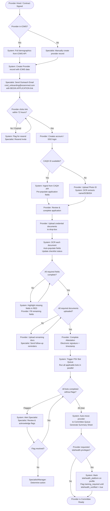

**Companion workflows triggered from Onboarding:**
- Work-history / professional-reference verification requests fan out in parallel with the PSV bots — see [Workflow 12](#workflow-12-reference--work-history-verification).
- Committee review picks up from `Committee Ready` — see [Workflow 3](#workflow-3-committee-review).
- Telehealth training completion is tracked as an Expirable (module #19) — see [Workflow 5](#workflow-5-expirables-tracking--renewal).

---

## Workflow 2: PSV Bot Execution

This workflow describes the lifecycle of a single Primary Source Verification (PSV) bot run.

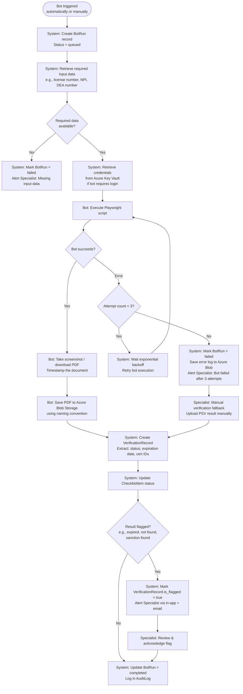

---

## Workflow 3: Committee Review

This workflow describes the committee preparation, review, and approval process.

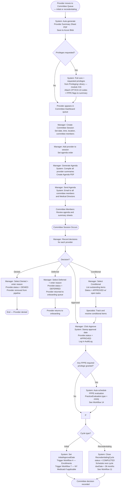

**Integration notes:**
- The same committee dashboard serves both **initial credentialing** and **recredentialing** (module #11). The workflow differs only at the very end: initial approvals trigger enrollments; recredentialing approvals close the cycle and schedule the next one.
- When a granted privilege carries `requires_fppe = true` in the Privileging Library (module #16), the approval automatically schedules a Focused Professional Practice Evaluation — see [Workflow 14](#workflow-14-oppefppe-evaluation-lifecycle).

---

## Workflow 4: Enrollment Submission

This workflow covers the process of enrolling a provider with a payer after credentialing approval.

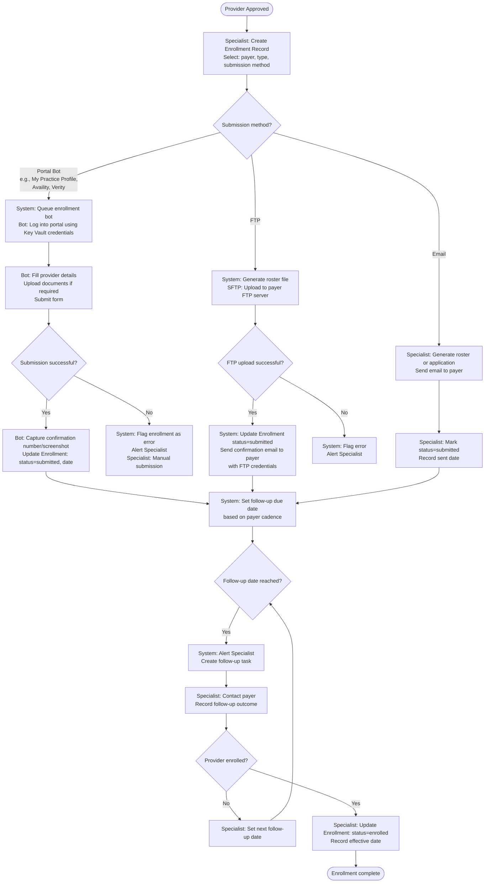

---

## Workflow 5: Expirables Tracking & Renewal

This workflow describes how expiring credentials are detected, confirmed, and renewed.

**Expirable classes covered:** state licenses, DEA, board certifications, malpractice insurance, CAQH attestation, BLS/ACLS/PALS, flu shot, PPD, hospital privileges, CME reporting cycles *(module #17)*, multi-state telehealth licenses *(module #19)*, and recredentialing due dates *(module #11, tracked separately — see Workflow 11 for the full lifecycle)*.

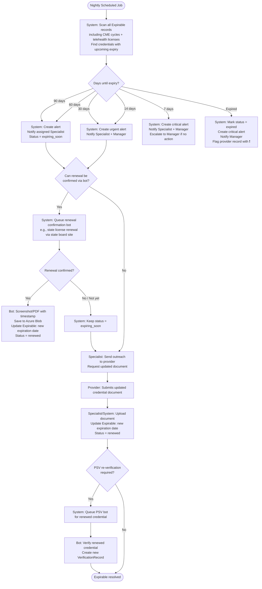

**Special-case expirables:**
- **CME reporting cycle** — when `days_until_cycle_end < 60` and `current_credits < required_credits`, system triggers a CME shortfall alert and opens a task on the provider for self-report (see [Workflow 15](#workflow-15-cme-tracking--attestation)).
- **Multi-state telehealth license** — each state listed in `ProviderProfile.teleHealthStates` is tracked as a separate expirable. Expiration of any one state removes only that state from the provider's telehealth coverage (the rest stay active).
- **Recredentialing dueDate** — not stored as an Expirable row; driven by the dedicated `RecredentialingCycle` scheduler in [Workflow 11](#workflow-11-recredentialing-cycle).

---

## Workflow 6: Sanctions Checking

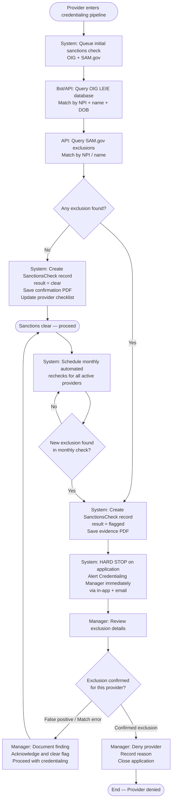

---

## Workflow 7: NY Medicaid ETIN Enrollment

Based on the Medallion reference flow adapted for the Essen internal platform.

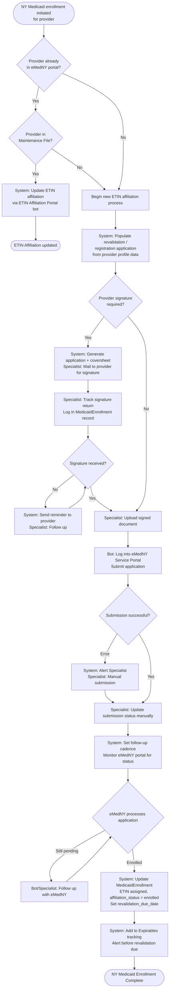

---

## Workflow 8: NPDB Query

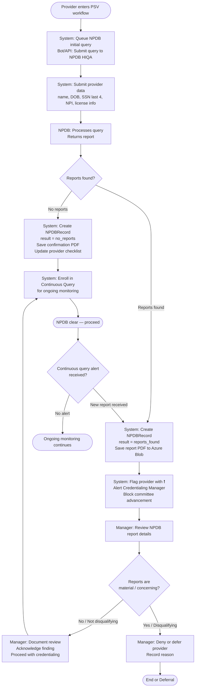

---

## Workflow 9: Provider Status Lifecycle

This diagram shows all possible status transitions for a provider record.

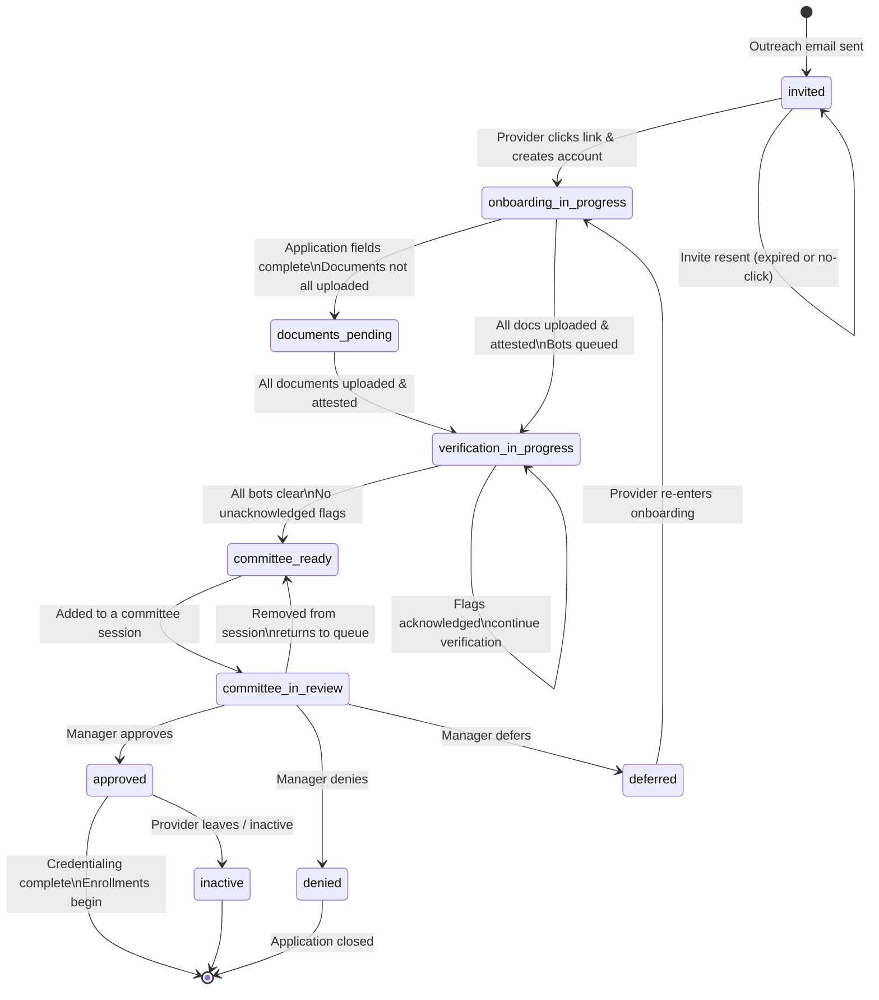

---

## Workflow 10: Staff Notification & Escalation

This diagram shows how alerts escalate when action is not taken.

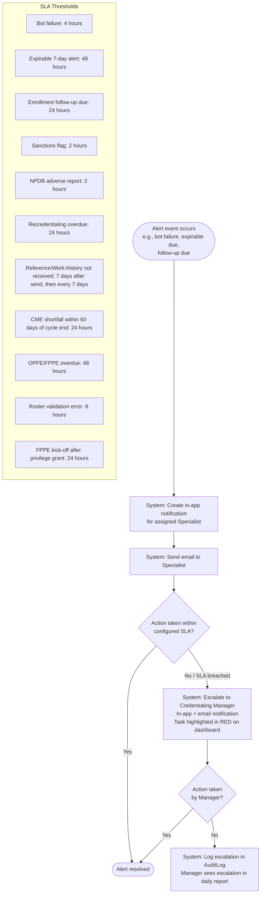

**SLA threshold summary (full table):**

| Alert type | Module | Initial SLA | Escalation trigger |
|------------|--------|-------------|--------------------|
| Bot failure (PSV) | 6 | 4 h to Specialist | → Manager after 4 h |
| Sanctions flag | 7 | 2 h to Manager | → Medical Director after 2 h |
| NPDB adverse report | 10 | 2 h to Manager | → Medical Director after 2 h |
| Expirable 7-day alert | 5 | 48 h to Specialist | → Manager after 48 h |
| Enrollment follow-up due | 4 | 24 h to Specialist | → Manager after 24 h |
| Recredentialing overdue | 11 | 24 h to Specialist | → Manager after 24 h |
| Reference / work-history unreceived | 13 | Reminder at 7 d, again at 14 d | → Specialist task after 21 d |
| CME shortfall (≤ 60 d to cycle end) | 17 | 24 h to Provider (outreach) + Specialist | → Manager 14 d before cycle end |
| OPPE/FPPE overdue | 15 | 48 h to Evaluator | → Manager after 48 h |
| Roster validation error | 14 | 8 h to Specialist | → Manager after 8 h |
| FPPE kick-off after privilege grant | 16 + 15 | 24 h to auto-create scheduled eval | — |

---

## Workflow 11: Recredentialing Cycle

Every credentialed provider is re-verified on a rolling 36-month cycle (configurable per payer/NCQA requirement). This workflow covers detection, application refresh, PSV re-run, and committee re-approval.

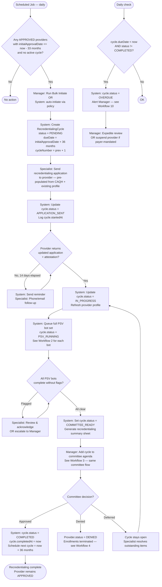

**Key rules:**
- Cycles run in parallel with an `APPROVED` provider — Provider.status does not change during recredentialing (tracked entirely via `RecredentialingCycle.status`).
- `initiateBulk` on the manager dashboard fires the 33-month-lookback query used above; the 3-month buffer gives Specialists lead time to collect the refreshed application.
- Payers may require shorter cycles (e.g. 24 months for high-risk specialties) — configurable via `cycleLengthMonths` on each `RecredentialingCycle`.

---

## Workflow 12: Reference & Work-History Verification

Covers both **employer work-history verification** and **professional reference checking** — both use the same public-token form pattern (module #13, NCQA-required).

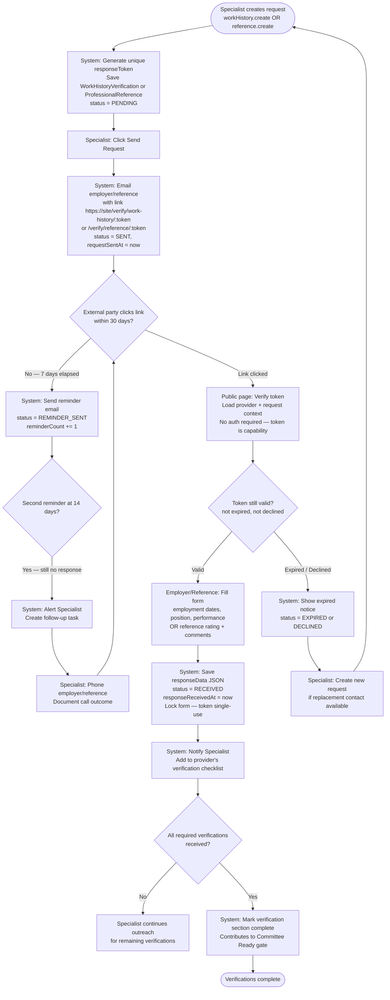

**Security notes:**
- Tokens are UUIDv4 (`responseToken`) and single-use. Once the form is submitted, the token is invalidated on the server.
- Public routes `/verify/work-history/:token` and `/verify/reference/:token` bypass auth middleware but rate-limit per token to prevent enumeration.
- Responses are stored as structured JSON for NCQA audit retrieval and, optionally, rendered to PDF for archival.

---

## Workflow 13: Roster Generation & Submission

Payer rosters are the bulk-enrollment format (CSV/Excel) sent to payers monthly or on-demand. Each payer has a `PayerRoster` template configuration; actual submissions are `RosterSubmission` records.

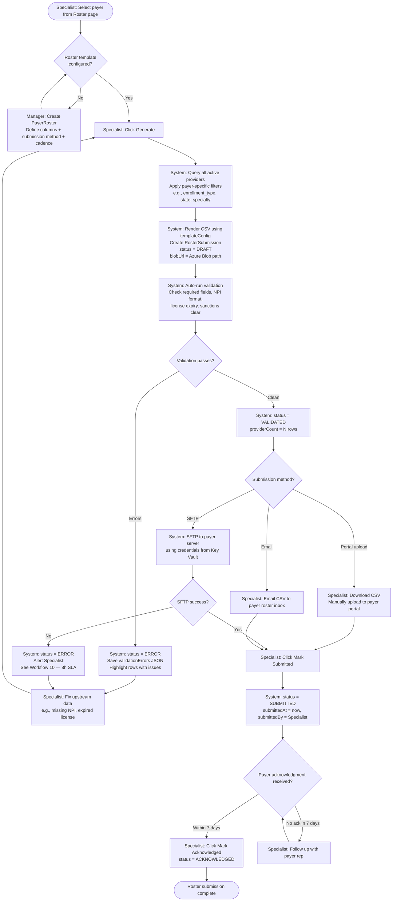

**Cadence & reporting:**
- Submissions feed the Performance & Analytics module (#20) for on-time-submission rate KPIs.
- Each row carries a digital signature header so payers can verify origin; the `templateConfig.signatureField` controls where it renders.

---

## Workflow 14: OPPE/FPPE Evaluation Lifecycle

**OPPE** (Ongoing) runs on a recurring cadence for every privileged provider (typically every 6 months). **FPPE** (Focused) is triggered by specific events: new privilege grant, performance concern, adverse event.

```mermaid
flowchart TD
    subgraph OPPE — periodic
        A([Scheduled Job — monthly]) --> B[System: For each APPROVED provider\nwith hospital privileges, check last OPPE periodEnd]
        B --> C{periodEnd + 6 months\nreached?}
        C -- Yes --> D[System: Create PracticeEvaluation\ntype = OPPE, status = SCHEDULED\nperiodStart/End = last 6 months\ndueDate = now + 30 days]
    end

    subgraph FPPE — triggered
        E([Trigger event]) --> F{Trigger type?}
        F -- New privilege granted — Workflow 3 --> G[System: Create PracticeEvaluation\ntype = FPPE, status = SCHEDULED\nprivilegeId = granted privilege\nperiodStart = approval date\ndueDate = now + 90 days]
        F -- Performance concern / adverse event --> H[Manager: Create FPPE manually\nLink to specific privilege or competency]
    end

    D --> I[System: Assign Evaluator\ntypically Medical Director or dept chair]
    G --> I
    H --> I

    I --> J[System: Notify Evaluator\nAdd to evaluator's task list]
    J --> K{Evaluator starts within dueDate?}
    K -- No — dueDate passed --> L[System: status = OVERDUE\nAlert Manager — Workflow 10 48h SLA]
    L --> M[Manager: Reassign OR expedite]
    M --> J
    K -- Yes --> N[Evaluator: status = IN_PROGRESS\nReview chart samples, peer feedback,\nquality indicators]

    N --> O[Evaluator: Fill indicators JSON\nBlood-draw accuracy, readmit rate, complication rate,\npeer review score, etc.]
    O --> P[Evaluator: Record findings + recommendation\nOption: Attach supporting document to Azure Blob]

    P --> Q{Recommendation?}
    Q -- Satisfactory --> R[System: status = COMPLETED\ncompletedAt = now\nContinue privileges]
    Q -- Concerns identified --> S[Manager: Open follow-up FPPE\nOR restrict specific privileges\nOR refer to committee]
    Q -- Failed --> T[Manager: Suspend privilege\nReport to committee — may trigger Workflow 3\nPossible NPDB report — Workflow 8]

    R --> U{Was this FPPE on new privilege\nwith requires_fppe = true?}
    U -- Yes --> V[System: Mark provider fully privileged\nRemove FPPE flag from privilege record]
    U -- No --> W([OPPE complete — next cycle scheduled])
    V --> W
    S --> W
    T --> X([Provider restricted — manager action continues])
```

**Integration:** every FPPE that's scheduled because of a new privilege from module #16 links back to `PrivilegeItem.id` so the committee can audit privilege outcomes.

---

## Workflow 15: CME Tracking & Attestation

Continuing Medical Education credits are tracked against each provider's specialty-board cycle. Most boards require 50 Category-1 credits per 2-year cycle.

```mermaid
flowchart TD
    A([Provider: Enters CME page]) --> B[Provider: Logs new CME activity\nactivity name, category, credits, completed date]
    B --> C{Upload certificate?}
    C -- Yes --> D[System: OCR certificate\nExtract provider name, activity, credits, date\nSave Document + CmeCredit with documentId]
    C -- No — self-report --> E[System: Save CmeCredit without documentId\nFlag as self-reported for later audit]

    D --> F[System: Update cycle totals]
    E --> F
    F --> G[System: Recalculate totalCredits\nfor current cycle\ncompare vs requirement \(default 50\)]

    G --> H{totalCredits >= required?}
    H -- Yes --> I[System: requirementMet = true\nProvider CV auto-regenerates]
    H -- No --> J{Days until cycle end?}

    J -- > 60 --> K([Continue tracking])
    J -- <= 60 --> L[System: Create CME shortfall alert\nsee Workflow 10 — 24h SLA]
    L --> M[Specialist: Outreach to provider\nRemind of deadline]
    M --> N{Provider logs more credits?}
    N -- Yes --> F
    N -- No, cycle ends --> O[System: Mark cycle INCOMPLETE\nAlert Manager — may affect recredentialing\nsee Workflow 11]

    I --> P([Cycle in good standing])
    O --> Q[Manager: Determine action\ngrace period, board extension, or compliance flag]
    Q --> R([End])

    S([Cycle end date reached]) --> T[System: Archive CME records\nSet next cycle periodStart = prev periodEnd\nReset counters]
    T --> K
```

**Auto-generated CV (module #17):**
- The provider's CV PDF is rebuilt after every new CME credit, license update, or privilege grant.
- CV renders from `Provider` + `ProviderProfile` + `License[]` + `CmeCredit[]` + `HospitalPrivilege[]` — no separate data store.
- Providers can download the latest CV from their application portal at any time; staff can download from the provider detail page.

---

## Workflow 16: Public REST API & FHIR Access

Module #18 exposes credentialing data to external partners — payers, hospital systems, HIEs — via two surfaces:
- `GET /api/v1/*` — Essen-native REST (API-key authenticated, scoped)
- `GET /api/fhir/Practitioner/*` — FHIR R4 compliant (CMS-0057-F provider directory)

```mermaid
flowchart TD
    A([Partner request for API access]) --> B[Manager: Create ApiKey\nSet name + permissions JSON\ne.g. providers.read, practitioner.read]
    B --> C[System: Generate plaintext key \(64 chars\)\nHash with SHA-256 → store keyHash\nShow plaintext ONCE to Manager]
    C --> D[Manager: Securely deliver key to partner]

    D --> E([Partner makes API request\nAuthorization: Bearer <key>])
    E --> F[Middleware: Extract bearer token\nSHA-256 hash the token\nLookup by keyHash in ApiKey table]

    F --> G{Key found, active, not expired?}
    G -- No --> H[Return 401 Unauthorized\nLog denial to AuditLog]
    G -- Yes --> I[Middleware: Update lastUsedAt\nLoad permissions JSON]

    I --> J{Permission covers\nrequested route?}
    J -- No --> K[Return 403 Forbidden\nLog authz failure to AuditLog]
    J -- Yes --> L[Middleware: Rate limit check\nper key_id + route]

    L --> M{Rate limit OK?}
    M -- No --> N[Return 429 Too Many Requests\nwith Retry-After header]
    M -- Yes --> O{Endpoint kind?}

    O -- /api/v1/... REST --> P[Handler: Query Prisma\nApply field-level PHI redaction\nSSN, DOB-day, home-address always stripped]
    O -- /api/fhir/Practitioner --> Q[Handler: Query Prisma\nMap Provider → FHIR R4 Practitioner resource\nCompliant with us-core-practitioner profile]

    P --> R[Return JSON \(application/json\)\nInclude X-Request-Id header]
    Q --> S[Return JSON \(application/fhir+json\)\nInclude meta.lastUpdated]

    R --> T[Audit: api.request written\nactor = api_key:<id>, path, status, duration]
    S --> T
    T --> U([Response sent to partner])

    H --> T
    K --> T
    N --> T
```

**Data safety guarantees:**
- **No PHI** — both surfaces redact SSN, full DOB (only year returned), home address, and any field marked `@phi` in the schema metadata.
- **Tamper-evident audit** — every request writes to the HMAC-chained `AuditLog` (module #18 shares the same audit trail used for staff actions).
- **Key lifecycle** — keys can be rotated (`POST /admin/api-keys/:id/rotate`) which invalidates the old hash and issues a new plaintext without service disruption if both are valid briefly.
- **CMS-0057-F compliance** — the FHIR endpoint is the canonical provider directory source for any payer that needs to point back at Essen per the federal rule's interoperability mandate.
