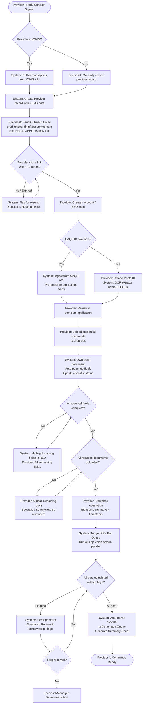
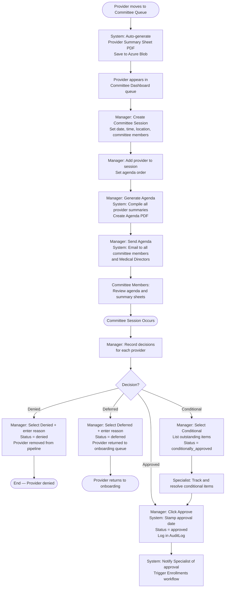
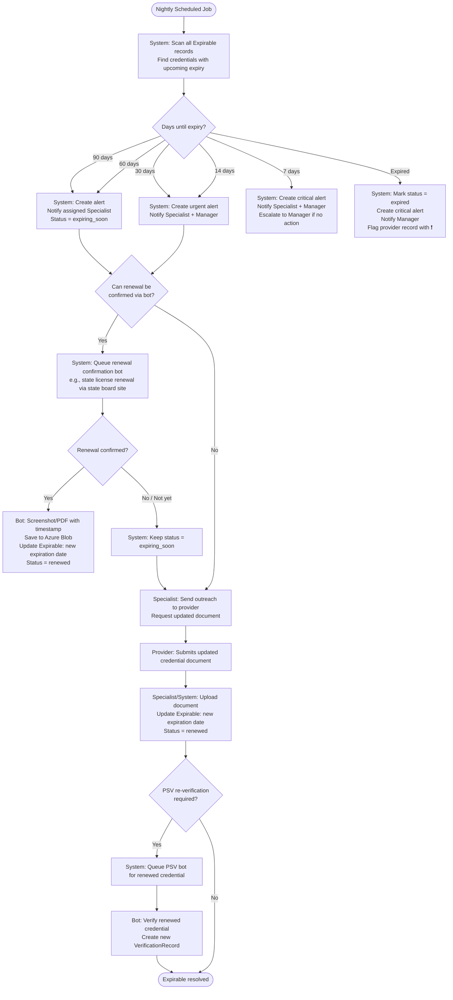
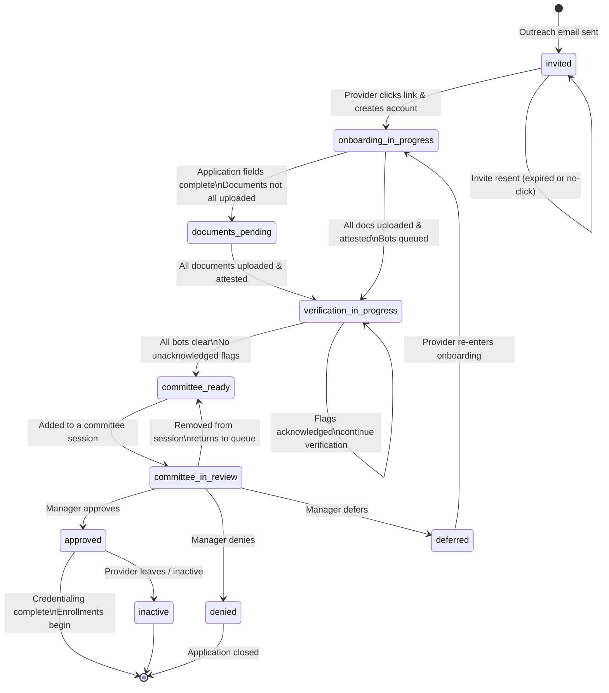
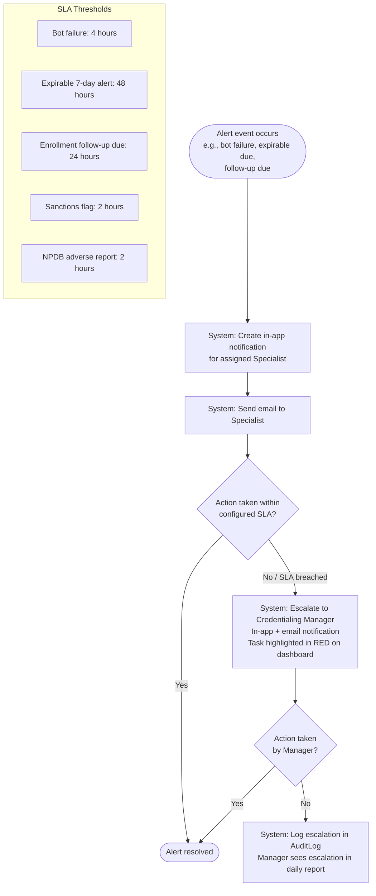

# ESSEN Credentialing Platform — Business Workflows

**Version**: 0.1 (Pre-Implementation)
**Last Updated**: 2026-04-14
**Status**: Draft — Pending stakeholder review

---

## Overview

This document defines the key end-to-end business workflows using Mermaid flowcharts. Each workflow describes the sequence of events, decision points, actors, and system automations involved.

Actors:
- **Provider** — external healthcare professional
- **Specialist** — Credentialing Specialist (Essen staff)
- **Manager** — Credentialing Manager (Essen staff)
- **Committee** — Medical Director or Committee Member
- **System** — automated platform action (no human)
- **Bot** — Playwright browser automation

---

## Workflow 1: Provider Onboarding (End-to-End)

This workflow covers the full onboarding journey from initial outreach through committee readiness.

---

## Workflow 2: PSV Bot Execution

This workflow describes the lifecycle of a single Primary Source Verification (PSV) bot run.

---

## Workflow 3: Committee Review

This workflow describes the committee preparation, review, and approval process.

---

## Workflow 4: Enrollment Submission

This workflow covers the process of enrolling a provider with a payer after credentialing approval.

---

## Workflow 5: Expirables Tracking & Renewal

This workflow describes how expiring credentials are detected, confirmed, and renewed.

---

## Workflow 6: Sanctions Checking

---

## Workflow 7: NY Medicaid ETIN Enrollment

Based on the Medallion reference flow adapted for the Essen internal platform.

---

## Workflow 8: NPDB Query

---

## Workflow 9: Provider Status Lifecycle

This diagram shows all possible status transitions for a provider record.

---

## Workflow 10: Staff Notification & Escalation

This diagram shows how alerts escalate when action is not taken.

